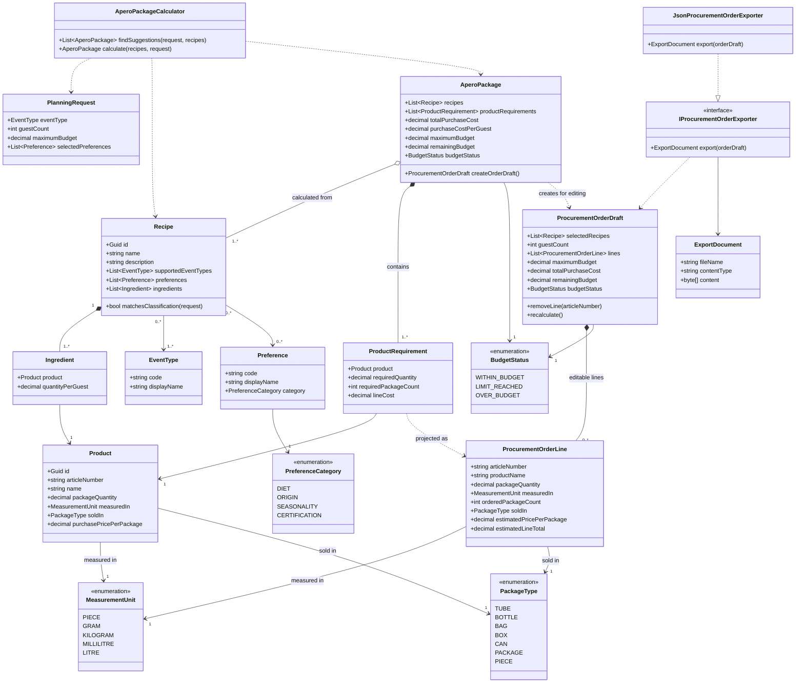
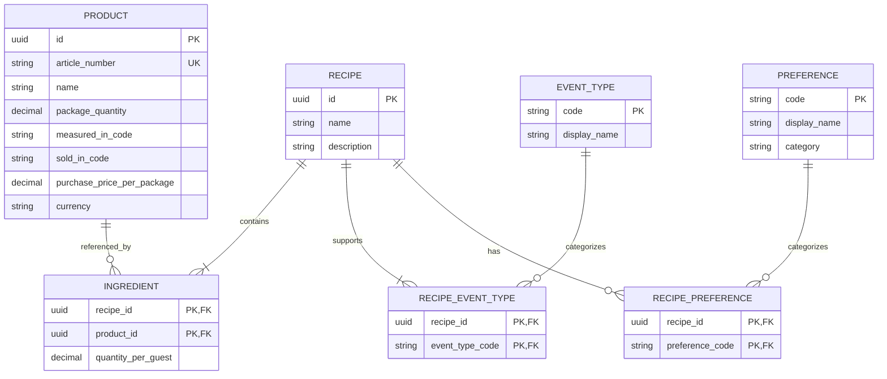

# Event in a Box - Object-Oriented Domain Model and ERM

## 1. Modelling approach

This specification uses conventional object-oriented design (OOD). It defines classes by responsibility, composition, associations, and replaceable interfaces. It deliberately avoids domain-driven design terminology and unnecessary abstractions.

The MVP remains intentionally small:

- A restaurateur enters event type, guest count, maximum total budget, and preferences.
- Stored recipes reference their required Transgourmet products.
- Product purchase prices and package sizes are initially mock data.
- The system calculates and filters zero to many single-recipe Apero packages.
- The user selects one or more recipes; the same calculator recalculates the combined Apero package.
- Exceeding the budget produces a clear warning but does not block the order flow.
- The user removes products already in stock from a separate procurement draft.
- The remaining procurement lines are exported as JSON.

## 2. Object-oriented Domain Model



## 3. Class responsibilities

| Class | Responsibility |
|---|---|
| `PlanningRequest` | Carries the four UI inputs into the calculation |
| `Recipe` | Stores an Apero-package definition, classification, and ingredients |
| `Ingredient` | Connects one recipe to one product and specifies quantity per guest |
| `Product` | Represents an exact Transgourmet article, package content, physical sales package, and purchase price |
| `MeasurementUnit` | Defines how the package content and ingredient requirement are measured |
| `PackageType` | Defines the physical form in which the product is sold, such as a tube, bottle, bag, or box |
| `EventType` | Classifies recipes by supported event type |
| `Preference` | Represents filters such as Vegan, Vegetarian, Regional, Seasonal, or Organic |
| `PreferenceCategory` | Groups preferences for consistent filtering and UI display |
| `AperoPackageCalculator` | Uses one algorithm to calculate both single-recipe suggestions and multi-recipe combinations |
| `AperoPackage` | Read-only calculated result for one or more recipes, including products, costs, and budget status |
| `ProductRequirement` | One aggregated product quantity, rounded package count, and line cost |
| `BudgetStatus` | Informational state for the UI; it never determines whether ordering is allowed |
| `ProcurementOrderDraft` | Editable supplier order created from an Apero package; products already in stock can be removed and totals recalculated |
| `ProcurementOrderLine` | Supplier-facing projection containing the article number, package content, ordered package count, and sales-package type |
| `IProcurementOrderExporter` | Converts the same confirmed draft into a replaceable output format |
| `JsonProcurementOrderExporter` | Produces the MVP JSON file |
| `ExportDocument` | Contains the generated filename, media type, and bytes |

The restaurateur is a system actor, not a class, because the MVP has no authentication or user profiles.

## 4. Collaborating interfaces

The following interfaces keep file formats and data sources replaceable without complicating the core model:

```text
IRecipeRepository
  getAll(): Recipe[]
  save(recipe): void

IProductRepository
  getAll(): Product[]
  getByArticleNumber(articleNumber): Product

IRecipeImporter
  import(xml): Recipe[]

IProcurementOrderExporter
  export(orderDraft): ExportDocument
```

Initial implementations:

```text
DatabaseRecipeRepository implements IRecipeRepository
MockProductRepository implements IProductRepository
XmlRecipeImporter implements IRecipeImporter
JsonProcurementOrderExporter implements IProcurementOrderExporter
```

Possible future replacements:

```text
TransgourmetProductRepository implements IProductRepository
```

The calculation classes never depend on XML, JSON, HTTP, or a specific database framework. The JSON exporter serializes the procurement draft only after the user confirms it.

## 5. Calculation behaviour

`AperoPackageCalculator` owns the only calculation algorithm. It accepts one or more recipes:

```text
single suggestion: calculate([recipeA], request)
selected combination: calculate([recipeA, recipeB, ...], request)
```

It first groups every ingredient from all input recipes by product. For each product:

```text
requiredQuantity(product) =
    sum(quantityPerGuest for product across all input recipes)
    * request.guestCount

requiredPackageCount =
    ceiling(requiredQuantity / product.packageQuantity)

lineCost =
    requiredPackageCount * product.purchasePricePerPackage
```

`measuredIn` and `soldIn` describe different concepts. For example:

```text
Product: Tomato paste
packageQuantity: 50
measuredIn: MILLILITRE
soldIn: TUBE
purchasePricePerPackage: CHF 2.40
```

If the selected recipes require 120 ml, the system orders `ceiling(120 / 50) = 3` tubes. `soldIn` is displayed and exported as packaging information but does not change the package-count formula.

For the complete Apero package:

```text
totalPurchaseCost =
    sum(productRequirements.lineCost)

purchaseCostPerGuest =
    totalPurchaseCost / request.guestCount

remainingBudget =
    request.maximumBudget - totalPurchaseCost
```

`findSuggestions` performs the following operation for every recipe and returns zero to many `AperoPackage` results:

```text
recipe.supportedEventTypes contains request.eventType
AND recipe.preferences contains every request.selectedPreference
AND calculate([recipe], request).totalPurchaseCost <= request.maximumBudget
```

Package rounding always happens after shared product quantities have been aggregated and before the budget is evaluated.

### Selecting multiple recipes

The restaurateur may select one or more recipes from the suggested packages. The system extracts those recipes and calls the same `calculate` method again. There is no second combination algorithm and no duplicate product-line class.

When selected recipes reference the same product, their quantities are added before package rounding. This avoids buying duplicate partially used packages:

```text
selectedPackage =
    calculate(selectedRecipes, request)
```

Budget states:

```text
WITHIN_BUDGET: totalPurchaseCost < maximumBudget
LIMIT_REACHED: totalPurchaseCost = maximumBudget
OVER_BUDGET: totalPurchaseCost > maximumBudget
```

An over-budget Apero package remains visible. The UI clearly shows the exceeded amount and lets the restaurateur either deselect a recipe or continue because the difference may be acceptable to the client.

Every Apero package can therefore create a procurement-order draft. Each product requirement is projected once into a `ProcurementOrderLine`, and the draft copies the maximum budget. After the restaurateur removes lines for products already in stock, it recalculates its total, remaining budget, and budget status. A negative `remainingBudget` is the amount by which the draft exceeds the limit. Removing an order line never changes the calculated Apero package.

The central business rule is:

```text
BudgetStatus controls presentation, not permission to order.
```

## 6. Object rules

1. `guestCount` must be a positive whole number.
2. `maximumBudget` must be greater than zero.
3. All monetary values use decimal arithmetic and CHF.
4. A recipe must have at least one ingredient.
5. An ingredient's `quantityPerGuest` must be greater than zero.
6. A product's article number must be unique.
7. Package quantity and purchase price must be greater than zero.
8. Every product must define one `measuredIn` value and one `soldIn` value.
9. An ingredient's `quantityPerGuest` and its product's `packageQuantity` use the product's `measuredIn` unit.
10. `soldIn` describes the physical sales package and does not replace the measurement unit.
11. Unit conversion is out of scope for the MVP.
12. All selected preferences act as mandatory filters.
13. Package rounding occurs before budget filtering.
14. Removing an order line from the procurement draft does not modify the recipes or calculated Apero package.
15. At least one recipe must be selected before an Apero package can be calculated.
16. Products shared by selected recipes are combined before package rounding.
17. An over-budget Apero package may create a procurement-order draft.
18. An over-budget procurement draft may be exported after explicit user confirmation.
19. The UI must display the budget limit, final purchase cost, and exceeded amount before confirmation.
20. The exported order contains only the procurement order lines remaining in the draft.
21. Recipe XML must reference products using their Transgourmet article number.
22. Recipes contain no selling price and no copied product purchase prices.

## 7. XML recipe import

The restaurateur uploads a recipe together with its ingredients. The XML importer:

1. Parses recipe name, description, event types, and preferences.
2. Reads every ingredient's Transgourmet article number and quantity per guest.
3. Resolves the article number through `IProductRepository`.
4. Creates the recipe and its ingredients.
5. Saves the recipe through `IRecipeRepository`.

The XML file itself does not need to be stored. Product prices remain in `PRODUCT`, so a recipe is recalculated using the current mock purchase prices each time suggestions are requested.

## 8. Entity-Relationship Model

The ERM contains only persisted master data. Planning requests, calculated Apero packages, product requirements, procurement drafts, procurement order lines, and exported files are temporary objects and therefore do not require tables.



## 9. Table responsibilities

| Table | Responsibility |
|---|---|
| `RECIPE` | Recipe metadata imported from XML |
| `PRODUCT` | Mock Transgourmet products, measured package content, sales package type, and current purchase prices |
| `INGREDIENT` | Quantity per guest for each product in a recipe |
| `EVENT_TYPE` | Available event types |
| `RECIPE_EVENT_TYPE` | Recipes supported by each event type |
| `PREFERENCE` | Available recipe-filter preferences |
| `RECIPE_PREFERENCE` | Preferences assigned to recipes |

The composite primary key `(recipe_id, product_id)` in `INGREDIENT` ensures that one product appears at most once in a recipe.

`PRODUCT.measured_in_code` is constrained to the supported `MeasurementUnit` values. `PRODUCT.sold_in_code` is constrained to the supported `PackageType` values. They remain columns rather than separate lookup tables for the MVP.

## 10. Deliberately absent tables

The MVP does not persist:

- Users or restaurateurs
- Inventory
- Planning requests
- Calculated Apero packages
- Product requirements
- Procurement-order drafts
- Procurement-order lines
- Orders or order history
- JSON files
- Logs or audit history

These can be added later without redesigning the recipe and product tables.

## 11. Instructions for coding agents

1. Use the class names and responsibilities in this specification.
2. Do not turn every class into a database entity.
3. Persist only the tables shown in the ERM.
4. Keep the single Apero-package calculation algorithm in `AperoPackageCalculator`, not in UI components.
5. Depend on the interfaces rather than concrete XML, JSON, or repository implementations.
6. Do not add authentication, inventory, order history, logging, or audit features.
7. Do not store selling prices on recipes.
8. Do not copy product purchase prices into recipe ingredients.
9. Use decimal types for all quantities and monetary values.
10. Write tests for scaling, measurement and sales-package separation, package rounding, preference filtering, multiple-recipe selection, shared-product aggregation, all budget states, order-line mapping, line removal, over-budget confirmation, and JSON export.
11. Do not create separate suggestion and combination calculation pipelines; both must call `calculate(recipes, request)`.
12. Never disable draft creation or export merely because `BudgetStatus` is `OVER_BUDGET`; require an explicit UI confirmation instead.
13. Treat `ProcurementOrderLine` as an export projection, not as a second calculation model.
14. Serialize the confirmed procurement draft only through `JsonProcurementOrderExporter`.
